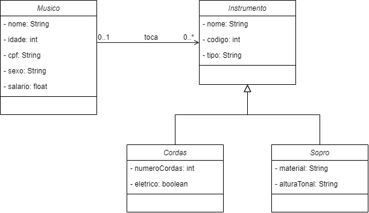

# Projeto de cadastro de Músicos Freelancers

O projeto desse repositório implementa um sistema de cadastro de músicos freelancers. Os músicos podem cadastrar um ou mais instrumentos que tocam. Os instrumentos podem ser de dois tipos: instrumentos de cordas ou instrumentos de sopro.

## Principais classes

- ***Musico:*** Representa um músico cadastrado.
- ***Instrumento:*** Classe abstrata que representa os instrumentos que o músico toca. Um músico pode tocar um ou mais instrumentos.
- ***Cordas:*** Classe que herda de instrumento e representa os instrumentos de cordas que o músico toca.
- ***Sopro:*** Classe que herda de instrumento e representa os instrumentos de sopro que o músico toca.

## Diagrama de classes

Abaixo o diagrama de classes do projeto:

## Documentação da API

A documentação da API é feita por meio de PostMan e está disponível no arquivo `appPauloSigiani_postman.json`.

## Link do Projeto

O projeto encontra se no link: [appPauloSigiani](https://github.com/paulosigiani/CadastroMusicos/).

## FIM
